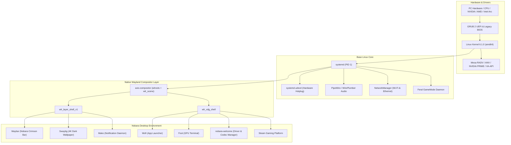

# AxisOS — Production Linux Operating System

<div align="center">

  <h1>▲ AxisOS 2.0 "Nobara Gaming Edition"</h1>
  <p><b>An out-of-the-box, high-performance Linux gaming and workstation OS powered by Debian 12, a custom native wlroots Wayland compositor, and pre-configured drivers and multimedia codecs.</b></p>

  <p>
    <a href="https://github.com/jackyphuti/AxisOS/releases"></a>
    
    
    
    <a href="LICENSE"></a>
  </p>

  <p>
    <a href="./INSTALLATION_GUIDE.md"><b>📖 Installation Guide</b></a> •
    <a href="./DEVELOPMENT.md"><b>🛠️ Build & Developer Guide</b></a> •
    <a href="./CONTRIBUTING.md"><b>🤝 How to Contribute</b></a> •
    <a href="https://github.com/jackyphuti/AxisOS/releases"><b>⬇️ Releases</b></a>
  </p>

</div>

---

## 🌟 Overview

**AxisOS 2.0 (Nobara Gaming Edition)** is built for users seeking an operating system that **"just works" right out of the box**—similar to Nobara Linux. It replaces browser-based/kiosk UIs with a **fully native desktop environment** powered by a custom **`wlroots` Wayland compositor** (`axis-compositor`), native status bar (`waybar`), application launcher (`wofi`), GPU-accelerated terminal (`foot`), and a native **Nobara Driver & Codec Manager** (`nobara-welcome`).

---

## 🚀 Key Features

- **Custom Native `wlroots` Compositor (`axis-compositor`)**: Modular, event-driven display server following the official TinyWL architecture with `wlr_scene` rendering, XDG shell window management, layer-shell support, hardware input routing, and smooth window move/resize operations.
- **Out-of-the-Box Drivers**: Pre-configured support and hardware detection for NVIDIA GPUs (PRIME offload ready), AMD Radeon (Mesa RADV with ACO compiler), and Intel Arc (Mesa ANV).
- **Comprehensive Multimedia Codecs**: Pre-installed GStreamer (Good, Bad, Ugly, Libav), FFmpeg, VA-API hardware video decode acceleration, and VDPAU.
- **Gaming & Proton Ready**: Pre-installed Valve Steam launcher, Proton 9.0 compatibility, Feral GameMode (`gamemode`), MangoHud overlay (`mangohud`), and high memory map limit (`vm.max_map_count = 2147483642`).
- **Nobara Welcome & Hardware Driver / Codec Manager (`nobara-welcome`)**: Native GTK3 graphical center for verifying drivers, validating codecs, configuring GameMode, and tuning system responsiveness.
- **Nobara Gaming Dark Desktop**: Custom dark charcoal (`#12161a`) theme with crimson (`#e53935`) accents across Waybar, Wofi, Mako notifications, and Foot terminal.
- **Real OS Installer**: Production installation wizard supporting automated GPT partitioning, Btrfs subvolumes (`@`, `@home`, `@snapshots`) with zstd compression, and GRUB EFI bootloader configuration.

---

## 🏗️ Architecture



---

## 📚 Documentation & Guides

To keep our repository organized and easy to navigate, detailed instructions have been segmented into dedicated guides:

| Document | Description |
| :--- | :--- |
| **[📖 Installation Guide](INSTALLATION_GUIDE.md)** | Step-by-step instructions for flashing to USB (Rufus, BalenaEtcher, Ventoy, `dd`), BIOS/UEFI setup, and bare-metal installation. |
| **[🛠️ Build & Developer Guide](DEVELOPMENT.md)** | Complete guide to installing dependencies, running local dev servers, compiling C modules, building the ISO, and running QEMU. |
| **[🤝 Contributing Guidelines](CONTRIBUTING.md)** | Code of conduct, pull request workflow, coding standards, and commit conventions. |
| **[📦 Package Manager Guide](pkg-mgr/README.md)** | Architecture and usage for the native `axis` package manager. |

---

## ⚡ Quick Start for Developers

For complete setup instructions, please see the **[Development Guide](DEVELOPMENT.md)**.

```bash
# 1. Clone repository
git clone https://github.com/jackyphuti/AxisOS.git
cd AxisOS

# 2. Install desktop shell dependencies
cd shell
npm install

# 3. Launch development server
npm run dev

# 4. In a separate terminal, launch the system daemon
npm run serve
```

---

## 🗓️ Release Roadmap

- **v1.0 "Horizon"**: Initial live ISO release with Wayland kiosk, installer, and core apps.
- **v2.0 "Horizon v2"** *(December Release)*:
  - Chromium-based Axis Browser integration
  - Linux kernel platform and character driver stack
  - High-performance File Manager with XDG trash and USB hotplugging
  - Dual-partition atomic updates (`axis update`) with `kexec` fast boot
  - Full-featured POSIX Terminal emulator and REPL engine
  - Production ISO release

---

## 📄 License

AxisOS is free and open-source software licensed under the **GNU General Public License v3.0 (GPL-3.0)**. See the [LICENSE](LICENSE) file for details.
